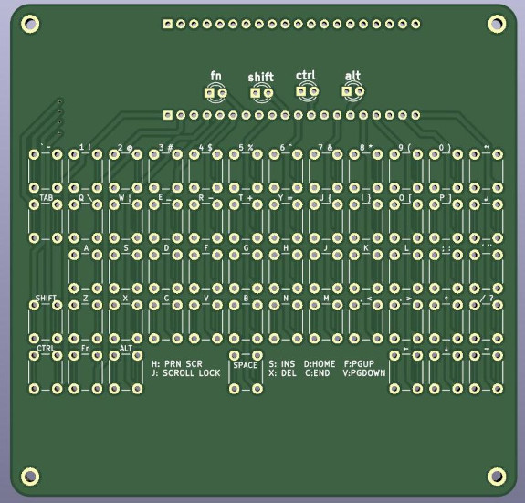
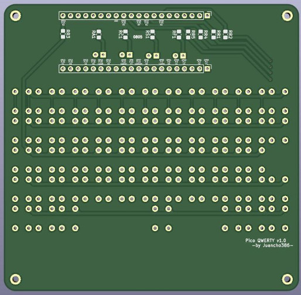

# K1: QWERTY keyboard para Pico

Teclado QWERTY con todas las teclas standard. El proyecto consta de 2 elementos:
- Circuito integrado PCB.
- Código en Arduino para programar un Raspberry Pico y emular el teclado.

> [!CAUTION]
> K1 es mi primer circuito que mando a imprimir. Aprendí de tutoriales en youtube y me animé. Puede contener errores de todo tipo. No me hago responsable de las consecuencias de ensamblarlo.

## Features:
- Tiene el ancho justo para complementar una pantalla de 4" (aproximadamente 9.6cm)
- Usa la tecla FN para extender teclas especiales como las teclas de función y las del keypad como insert, home, end, print screen, etc.
- Minimiza el espacio pero manteniendo una distancia adecuada para escribir con los pulgares.
- Lleva notación de todas las teclas posibles en la capa silk del PCB

### El PCB
De adelante

De atras

v1.0 built

#### Lista de materiales
- Raspberry Pi Pico
- 2 tiras de Connector 20xPin Headers
- 5x12-6 micro switches de 6x6x6
- 5+3 resistencias THT 0805 de 330Ω
- 4 LEDs

