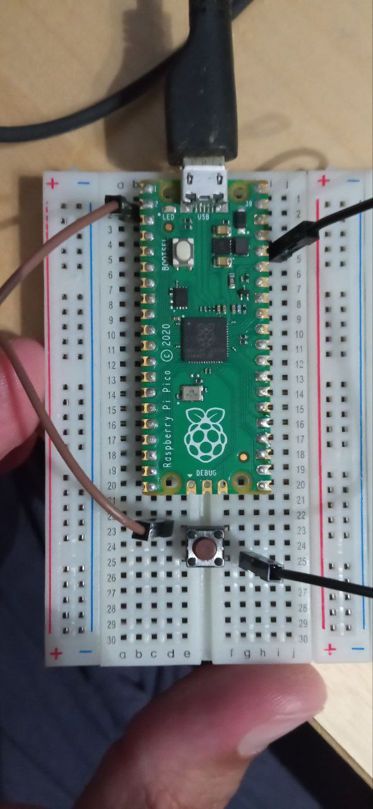

# No AFK

## Idea
* Un dispositivo que tenga un solo botón para encender y apagar
* Uso un Raspberry PI Pico
* Compilo con Arduino IDE
* Se conecta al USB y al apertar el botón, enciende un bucle infinito con teclas de teclado.
* Para apagarlo hay que mantener presionado el botón hasta que la luz se apague

## Cableado
- PIN2 (GPIO1) -> BTN -> PIN36(3V3_OUT)
- TODO: Circuito simple imprimible

## Versiones
- gaming_edition: Envía "A", "S", "D" o "W" con intervalos de tiempo variables.
- office_edition: No envía caracteres imprimibles. Sólo la tecla CTRL cada 5 segundos.

